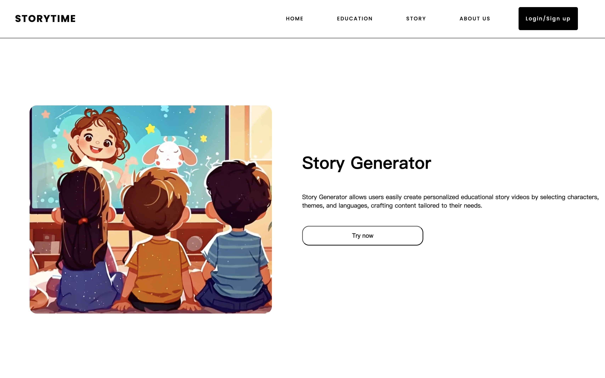

# StoryTime

[](https://github.com/gss10282023/StoryTime/actions) [](CHANGELOG.md) [](LICENSE)
[](https://adoptium.net/) [](https://spring.io/projects/spring-boot) [](https://www.postgresql.org/) [](https://gradle.org/)

StoryTime 是一个面向儿童/家长/教育场景的“故事化学习”生成器。用户选择主题、年龄段、角色与语言，系统生成可视化的故事/教学内容（文本/图像/音频/视频）。

English: `README.md`

## Demo



## 截图


## 功能特性

- 童话故事生成（含图像/音频/可选视频），通过 WebSocket 实时推送进度与结果
- 教学内容生成（句子 + 图片 + 音频 + 可选视频）
- PostgreSQL 持久化与简单的 dashboard 展示
- 可选外部集成：OpenAI、Stable Diffusion、Luma、S3 兼容对象存储

## 技术栈

- 后端：Spring Boot 3.3.4（Spring Web、WebSocket/STOMP、Thymeleaf、WebFlux）
- 数据：PostgreSQL + JPA/Hibernate + MyBatis
- API 文档：SpringDoc OpenAPI（`/swagger-ui/index.html`、`/v3/api-docs`）
- 对象存储（可选）：AWS SDK S3（例如 Vultr Object Storage）
- 构建/测试：Gradle 8.10.2（Java 17）、JUnit 5、JaCoCo、GitHub Actions CI

## 运行机制（技术细节）

- UI 使用 Thymeleaf 服务端渲染（`src/main/resources/templates`），静态资源在 `src/main/resources/static`。
- 故事/教学内容生成由 HTTP POST 触发并异步执行；浏览器通过 WebSocket 接收进度与结果。
- WebSocket 使用 STOMP over SockJS：
  - 端点：`/ws`
  - Broker 前缀：`/topic`
  - App 前缀：`/app`
  - 按会话推送：`/topic/progress/{sessionId}`、`/topic/scene/{sessionId}`、`/topic/result/{sessionId}`
  - 全局推送（图片接口）：`/topic/image`、`/topic/error`
- `local` 与 `demo` profile 会从 `src/main/resources/db/schema.sql` 初始化表结构。

## 快速开始

### 前置要求

- Java 17
- PostgreSQL 15+（或 Docker + Docker Compose）

### 方式 C：Demo 模式（无需外部 API Key）

该模式使用内置示例图片/音频/视频资源，不会调用 OpenAI / Stable Diffusion / Luma / S3。

```bash
docker compose up -d
./gradlew bootRun --args='--spring.profiles.active=demo'
```

启动后访问：`http://localhost:8080/`

### 方式 A：Docker 起 Postgres + 本地跑应用

```bash
docker compose up -d
cp .env.example .env
set -a
source .env
set +a
./gradlew bootRun --args='--spring.profiles.active=local'
```

注意：需要先启动 Docker Desktop（daemon）。

启动后访问：`http://localhost:8080/`

### 方式 B：本机 Postgres

1. 创建数据库 `storytime`
2. 设置 `.env.example` 中的 `SPRING_DATASOURCE_*` 环境变量
3. 运行：

```bash
./gradlew bootRun --args='--spring.profiles.active=local'
```

`local` profile 会从 `src/main/resources/db/schema.sql` 初始化表结构。

## 配置项

必须：

- `SPRING_DATASOURCE_URL`
- `SPRING_DATASOURCE_USERNAME`
- `SPRING_DATASOURCE_PASSWORD`

可选（按功能启用）：

- `OPENAI_API_KEY`
- `STABLEDIFFUSION_API_KEY`
- `LUMA_API_KEY`
- `VULTR_ACCESS_KEY`, `VULTR_SECRET_KEY`, `VULTR_BUCKET_NAME`, `VULTR_ENDPOINT`

## 开发与测试

- 运行测试：`./gradlew test`
- 报告：
  - JUnit：`build/reports/tests/test/index.html`
  - JaCoCo：`build/reports/jacoco/test/html/index.html`
- 调用外部 API 的集成测试会在未设置 `OPENAI_API_KEY` / `STABLEDIFFUSION_API_KEY` 时自动跳过。

## 数据与隐私（Data & Privacy）

- StoryTime 会将生成内容与元数据写入 PostgreSQL（例如用户记录、故事文本、图片/视频 URL、生成时间等）。
- 若配置了外部能力，StoryTime 可能会把用户输入与 prompt 发送到第三方服务（OpenAI / Stable Diffusion / Luma），并可能将生成素材上传到 S3 兼容对象存储。
- `demo` profile 不会发起任何外部 AI/S3 请求。

## 安全提示

当前在 `src/main/resources/application.properties` 中排除了 Spring Security 的默认自动配置。如果要公开部署，请务必补齐认证/鉴权、会话与安全策略（HTTPS、CSRF、CORS 等）。

## 贡献

见 `CONTRIBUTING.md`。

## License

MIT License，见 `LICENSE`。
